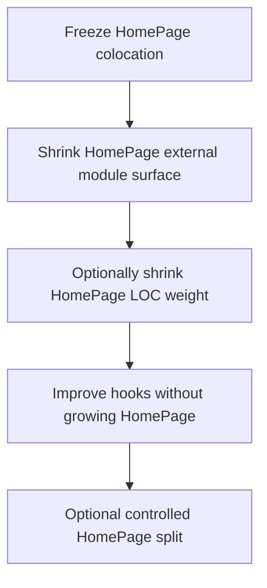

# Architecture Recovery Plan (export 20260730)

## Verdict

**Architecture dropped to ~3.88 (UI 3.8) even though several Architecture sub-metrics improved.** Maintainability rising to ~4.6 is expected and orthogonal.

| System metric | ~20260728 | **20260730** | Direction |
| --- | --- | --- | --- |
| Architecture | ~3.98 | **3.88** | ↓ |
| Structure | 3.49 | **3.57** | ↑ |
| Component coupling | 3.32 | **3.39** (chart **3.3**) | ↑ slight |
| Component adjacency | 2.90 | **3.03** (chart **3.0**) | ↑ |
| Communication | 3.72 | 3.77 | ↑ |
| Data access | 3.37 | 3.43 | ↑ |
| Data coupling | 3.5 | **3.5** | = (leave alone) |
| **Knowledge** | **~5.4** | **4.51** | **↓ large** |
| Component freshness | ~5.36 | **4.03** | **↓ large** |

Charts match CSV: coupling gauge **3.3**, adjacency gauge **3.0**, treemaps show HomePage dominating volume at 3★ with **396 external deps** / **19 adjacent**.

**Why Maintainability ↑ and Architecture ↓:** Maintainability rewards smaller units and Accepted hubs. Architecture is volume-weighted across components and includes Knowledge/freshness. Mass colocation into HomePage + touching most of the tree hurt freshness and made the worst-rated giant component even heavier.

---

## What the treemaps prove

- **HomePage ≈ half–two-thirds of the system by LOC** → its local score dominates Architecture.
- Coupling treemap: HomePage **External dependencies: 396** (was 648 — absolute count better, rating still poor at **2.92**).
- Adjacency treemap: HomePage **Adjacent components: 19** (was **28** — fewer neighbors, but rating **2.86 → 2.61** worse because size/intensity rose).
- Small `hooks` block is red/orange on adjacency (**1.49**, 105 neighbors) — still the worst local adjacency.
- `api-hooks` orange on adjacency (**1.92**, neighbors **28 → 62** — **regressed**).

---

## Component deltas that matter

### HomePage (the problem)

| | Before | After |
| --- | --- | --- |
| LOC | 31 245 | **43 989** (+41%) |
| Architecture (local) | ~3.82 | **3.62** |
| Coupling rating | 3.02 | **2.92** |
| External deps | 648 | **396** |
| Adjacency rating | 2.86 | **2.61** |
| Adjacent components | 28 | **19** |
| Freshness | ~5.37 | **3.75** |

Fewer neighbors and fewer external deps, but **much more code** inside a still-poorly-rated component → volume-weighted Architecture falls.

### hooks (smaller but still toxic)

| | Before | After |
| --- | --- | --- |
| LOC | 3 756 | **1 411** |
| Adjacent | 119 | **105** |
| Adjacency rating | 1.50 | **1.49** |
| Outgoing deps | 57 | **1** |
| Incoming deps | 444 | **255** |

Colocation worked for size/outgoing; **adjacency rating barely moved**. Remaining shared surface (`useContent`, `useLogAction`, `zustand/ui`, feature stores) still has huge fan-in from HomePage.

### helpers split (Wave side-effect)

- Top-level `src/helpers` **removed** as one component; replaced by `ArcGISHelpers`, `http`, `geo`, `points`, …
- `ArcGISHelpers` improved: adjacency **2.26 → 2.75**, coupling **3.22 → 4.03**, LOC **1293 → 412**.
- `src/api` removed (Wave 4 fold) — good cleanup.

### api-hooks (unexpected regression)

- Neighbors **28 → 62**, adjacency **2.39 → 1.92**.
- HomePage still imports **~26 distinct** api-hooks modules (many `*Core` mutations).

### Dependency graph (HomePage outgoing, Code call)

Rough component targets:

1. **`src/hooks` — 511 edges** (dominant)
2. `src/api-hooks` — 101
3. `src/helpers/ArcGISHelpers` — 83
4. Then geo / arcgis / points / http (small)

Distinct modules imported by HomePage:

- **62** hooks modules (top: `useContent` 163, `useLogAction` 137)
- **26** api-hooks modules (top: `useUpdateDataCore` 25)
- **19** ArcGISHelpers modules

Note: some dependency rows still list old paths under `src/hooks/consts|wizard|hover-click-handlers|…`. Treat the CSV as possibly mid-migration / mixed; trust **summary + adjacency/coupling component tables** as ground truth for scores.

---

## Strategy change (mandatory)

### Stop

- **No more “move everything HomePage-only into HomePage” waves.** That strategy improved adjacency system-wide slightly but **hurt HomePage local Architecture and Knowledge**, which dominate the star.

### Do not

- Grind Unit size for Architecture
- More SQL / Data-coupling work (already **3.5**, CC=1)
- Rewrite `useContent` / `useLogAction`
- Blind Independence `*Core` façade games
- Dockerfile / Nginx

---

## Recommended workstreams (priority order)

### P0 — Freeze and verify

1. No further whole-folder moves into HomePage.
2. Confirm which git commit Sigrid scanned (must include Waves 2–4 if you want to judge them).
3. Accept that Knowledge/freshness will partially recover if churn stops (no guarantee on next scan alone).

### P1 — Shrink HomePage’s **distinct external modules** (coupling lever)

Goal: lower HomePage **External dependencies (396)** and coupling rating **2.92**, without growing HomePage LOC.

**Highest ROI:**

1. **`api-hooks` barrels** — e.g. single `api-hooks/mutations` entry that re-exports create/update/delete cores so HomePage imports **1–2** modules instead of many `*Core` files. (Keep public APIs; behavior unchanged.)
2. **`hooks` barrels for shared UI stores** — careful barrel(s) under `hooks/zustand/ui` so HomePage doesn’t fan out across dozens of store files. Do **not** rewrite hubs; only re-export.
3. Leave `useContent` / `useLogAction` as Accept hubs (already Risk accepted).

Success signal: HomePage external deps ↓; `api-hooks` adjacent count ↓ from 62.

### P2 — Evaluate **Wave-4 ArcGISHelpers partial revert** (volume lever)

Moving ~62 ArcGISHelpers files **into** HomePage grew HomePage to **44k LOC**. Shared map primitives belong in `helpers/ArcGISHelpers` (platform), not inside the page.

**Candidate:** move the Wave-4 ArcGISHelpers cluster **back** to `src/helpers/ArcGISHelpers`, keep only true page-orchestration wrappers in HomePage.

Trade-off:

- HomePage LOC ↓ (helps volume weight)
- HomePage↔ArcGISHelpers edges may ↑ again (adjacency neighbor already exists)
- ArcGISHelpers local scores may dip slightly but HomePage dominates the system

Run `tools/analyze-movable.mjs`-style checks **in reverse** before executing. Prefer this over more colocation.

### P3 — Improve `hooks` adjacency **without** growing HomePage

- Keep only true shared modules in `src/hooks` (already mostly done).
- Avoid new HomePage→hooks edges.
- Do **not** move remaining shared stores into HomePage (creates reverse edges / mega-page growth).
- If anything still under `src/hooks` is HomePage-only **and** moving it does not pull large support trees into HomePage, small targeted moves only — measured, not batch-everything.

### P4 — Controlled HomePage split (only if still &lt; 4.0 after P1–P3)

Last resort: split Sigrid top-level components along real product seams, e.g.:

- `Components/HomePage` shell (map + chrome)
- `Components/Voorbereiding`
- `Components/Nabewerking`
- `Components/HomePageTools`

Rules:

- Shared map/state stays in `hooks` / `helpers` / `api-hooks`
- **No** cycles between the new components
- Expect adjacency neighbor counts to change; simulate import graph first
- Earlier guidance warned mega-splits can worsen adjacency — treat as experiment with a rollback commit

---

## Out of scope / Accept-only

- Data coupling / SQL repos
- Module coupling hubs already Risk accepted
- Component entanglement on HomePage / hooks — leave Raw until Architecture recovers
- Unit size (689) — Maintainability track after Architecture ≥ 4.0

---

## Success criteria (next rescan)

| Metric | Target |
| --- | --- |
| Architecture (system) | **≥ 4.0** (display) |
| Component adjacency | **≥ 3.1** (hold gains; don’t regress) |
| Component coupling | **≥ 3.4** |
| HomePage LOC | **↓ vs 43 989** (if P2 done) |
| HomePage external deps | **↓ vs 396** |
| HomePage adjacency rating | **↑ vs 2.61** |
| api-hooks adjacent count | **↓ vs 62** |
| Data coupling | **stay ~3.5** |
| Knowledge / freshness | Stabilize (less churn) |

## Immediate next step for the agent

1. User confirms Sigrid scan commit.  
2. Implement **P1 api-hooks mutation barrel** (smallest, reversible).  
3. Decide **yes/no** on ArcGISHelpers revert (P2) after a short LOC/edge estimate.  
4. Deploy → rescan → re-export summary + adjacency + coupling.

---

## One-line summary

**Stop feeding the HomePage mega-component; cut its external module surface; optionally move shared ArcGIS back to helpers; only split HomePage if that still isn’t enough for Architecture ≥ 4.0.**
