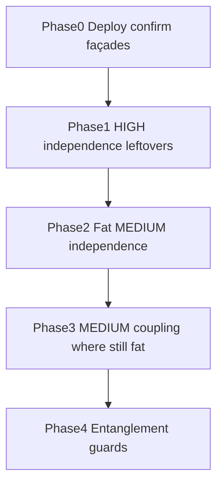

# Architecture remediation phases — LIS

**Source:** [`all-findings-rijkswaterstaat-otg-lis-20260717/`](./all-findings-rijkswaterstaat-otg-lis-20260717/)  
**Scope:** Module coupling · Component independence · Component entanglement only  
**Dashboard:** Architecture **3.3** (+1.04 / +1.08 depending on UI refresh)

This document phases architecture work only. Security, reliability, duplication, and unit size/complexity/interfacing live in [`REMEDIATION-PLAN.md`](./REMEDIATION-PLAN.md).

## Scoreboard (July 17 RAW)

| Category | RAW | Severity |
| --- | ---: | --- |
| Module coupling | 29 | HIGH 2 · MEDIUM 13 · LOW 14 |
| Component independence | 118 | HIGH 27 · MEDIUM 91 |
| Component entanglement | 9 | MEDIUM 2 · LOW 7 |

**Total architecture RAW: 156**

## Rules

- Behavior-preserving refactors only: extract pure helpers; keep public import paths as short façades.
- Do **not** split HIGH fan-in hubs (`useLogAction`, `useContent`) for score.
- Do **not** edit Dockerfiles / Nginx / deployment files for architecture.
- Status labels used below:
  - **Await deploy** — already thin in the workspace; July 17 CSV still shows old size
  - **Code next** — still large enough on disk to justify another extract
  - **Accepted** — intentional interface / hub / directory aggregation

---

## Phase 0 — Confirmation gate (no new code)

**Goal:** Deploy the current workspace and re-export so already-thinned façades drop off the Architecture board.

Many July 17 “fat interface module” rows are already façades on disk. Re-coding them will not move Architecture until Sigrid scans this tree.

### HIGH independence — Await deploy

| File | July 17 LOC | Workspace ~LOC | Status |
| --- | ---: | ---: | --- |
| `src/hooks/hover-click-handlers/usePlanStarGraphic.ts` | 53 | 6 | Await deploy |
| `src/hooks/map/syncBluePointGraphics.ts` | 48 | 4 | Await deploy |
| `src/hooks/useMapInitialization.ts` | 47 | 14 | Await deploy |
| `src/hooks/editPoint/useCoordinateSystemSync.ts` | 42 | 14 | Await deploy |
| `src/api-hooks/consts/useLookupQuery.ts` | 39 | 13 | Await deploy |
| `src/hooks/hover-click-handlers/usePointHover.ts` | 33 | 10 | Await deploy |
| `src/hooks/hover-click-handlers/useGeometryListHover.ts` | 31 | 11 | Await deploy |
| `src/api-hooks/flightPlans/useFlightPlanLookupQueries.ts` | 29 | 19 | Await deploy |
| `src/hooks/hover-click-handlers/usePlanHover.ts` | 28 | 6 | Await deploy |
| `src/hooks/hover-click-handlers/usePlanClick.ts` | 27 | 6 | Await deploy |
| `.../attachmentDisplayUrl.ts` | 13 | 1 | Await deploy |

### MEDIUM independence / coupling — Await deploy

| File | July 17 LOC | Workspace ~LOC | Status |
| --- | ---: | ---: | --- |
| `src/helpers/tableExports/pointsPlansTableExport.ts` | 251 | 18 | Await deploy |
| `src/helpers/ArcGISHelpers/createGeometryMapGraphics.ts` | 138 | 15 | Await deploy |
| `src/helpers/ArcGISHelpers/createPlanBoundingBoxGraphic.ts` | 130 | 13 | Await deploy |
| `src/hooks/zustand/shared/flightPlanFormFields.ts` | 127 | 23 | Await deploy |
| `src/helpers/ArcGISHelpers/createPointMapGraphics.ts` | 122 | 19 | Await deploy |
| `src/helpers/ArcGISHelpers/calculateCenterAndZoom.ts` | 118 | 8 | Await deploy |
| `src/lib/invalidateAfterMutation.ts` | 99 | 12 | Await deploy |
| `src/helpers/ArcGISHelpers/bufferGraphics.ts` | 98 | 9 | Await deploy |
| `backend/src/configureExpressApp.ts` | 97 | 8 | Await deploy |
| `src/utils/useUpdateData.ts` | 53 | 2 | Await deploy |
| `src/utils/useCreateData.ts` / `useDeleteData.ts` | 59 | 1 | Await deploy |

**Exit criteria:** Next Sigrid export shows independence/coupling drops for the rows above.

---

## Phase 1 — Remaining HIGH independence (code)

**Goal:** Thin HIGH “interface module” hooks that are still ~25–35 LOC on disk (or grew slightly). Leave tiny domain query hooks Accepted (see appendix).

| File | July 17 LOC | Workspace ~LOC | Action |
| --- | ---: | ---: | --- |
| `src/hooks/features/useRenderLocalGeometries.ts` | 24 | 32 | Code next — extract render sync helper |
| `src/api-hooks/flightPlans/useRegionalFlightPlanQueries.ts` | 37 | 32 | Code next — keep config outside hook; shrink wrappers |
| `src/hooks/hover-click-handlers/useDrawYellowMarkers.ts` | 29 | 28 | Code next — finish yellow sync façade if still mixed |
| `src/hooks/features/useHoverPointsAndGeometries.ts` | 41 | 28 | Code next — lifecycle-only wrapper |
| `src/hooks/points/useHerhalenSelectionHandlers.ts` | 44 | 27 | Code next — thinner wiring over `herhalenSelectionActions` |
| `src/api-hooks/finishedPlans/useFinishedPlanQueries.ts` | 27 | 27 | Code next if still packs multiple query defs |
| `src/hooks/hover-click-handlers/useDrawYellowGeometries.ts` | 35 | 25 | Code next — ensure sync helper owns body |
| `src/hooks/hover-click-handlers/useGeometryEditHighlight.ts` | 24 | 25 | Code next if highlight logic still inline |

**Skip / Accepted in Phase 1:** `useLogAction` (21), `useConstSelectOptions` (17), `usePlanPointAttachments` (15), `useGetFlightTimesDistance` (~14), `refreshToken` (11), `useEmailsList` (10), `usePointLookupQueries` / `useTemplateFlights` (22) — cohesive small interface boundaries.

**Tactic:** Pure helpers in sibling modules; public hook path stays stable.

**Exit criteria:** Targeted HIGH hooks are thin orchestration (~≤20 LOC where practical) without changing map/API behavior.

---

## Phase 2 — Fat MEDIUM independence (code)

**Goal:** Split MEDIUM interface modules that are **still large on disk**. Skip Phase 0 façades.

### Priority A (largest remaining)

| File | July 17 LOC | Workspace ~LOC | Action |
| --- | ---: | ---: | --- |
| `src/helpers/ArcGISHelpers/createGeometryGraphic.ts` | 125 | 72 | Code next — types/symbols/builders out |
| `src/helpers/arcgis/deleteArcgisAttachment.ts` | 59 | 65 | Code next — request/parse/apply split |
| `src/helpers/ArcGISHelpers/createPin.ts` | 56 | 56 | Code next — symbol vs graphic factory |
| `src/helpers/ArcGISHelpers/finishedPlanMapGraphics.ts` | 56 | 56 | Code next — center/zoom vs graphic apply |
| `src/helpers/ArcGISHelpers/createPointGraphic.ts` | 86 | 55 | Code next — finish symbol/coord split |
| `src/hooks/layout/useResizableSidebar.ts` | 69 | 52 | Code next — more math already extracted; shrink effect surface |
| `src/hooks/bottom/useBottomCompactListView.ts` | 47 | 47 | Code next — view-state vs DOM measure |
| `src/hooks/flightPlan/usePopulateFlightPlanFormEffect.ts` | 46 | 46 | Code next — effect wiring only |
| `src/hooks/filters/useFilterGeometries.ts` | 45 | 50 | Code next — predicate helpers out |
| `src/hooks/zustand/shared/planContentSelectionState.ts` | 45 | 45 | Code next — selectors vs store surface |
| `src/helpers/ArcGISHelpers/createNewPointEvent.ts` | 44 | 44 | Code next — event payload builders |
| `src/hooks/hover-click-handlers/useDrawPath.ts` | 61 | 45 | Code next — path sync already started; finish thin hook |
| `src/hooks/hover-click-handlers/useFeatureLayerPopup.ts` | 51 | 38 | Optional — already partly extracted |

### Priority B (after A)

Continue down the MEDIUM independence CSV for files still ≥~35 LOC on disk (`useWizardButtons`, result-tab hooks, filter hooks, remaining ArcGIS helpers). Prefer modules that are also MEDIUM coupling (high fan-in).

**Exit criteria:** Priority A interface files are façades / thin orchestration; public imports unchanged.

---

## Phase 3 — MEDIUM coupling (only where still fat)

**Goal:** Reduce “fat + popular” modules. Do **not** touch HIGH coupling hubs.

| File | Fan-in | July 17 LOC | Workspace ~LOC | Action |
| --- | ---: | ---: | ---: | --- |
| `.../nnederlandLayerIcons.tsx` | 24 | 69 | 69 | Code next — icon map / lookup tables out of UI module |
| `.../nnederlandLayerBuilders.ts` | 34 | 61 | 72 | Code next — builder envelope already shared; shrink further if mixed |
| `backend/src/routes/auth2/authSecurityLog.ts` | 26 | 47 | 47 | Code next only if unrelated concerns bundled |
| `backend/src/helpers/http/routeResponses.ts` | 26 | 41 | 41 | Accepted if single-purpose HTTP helpers |
| `src/hooks/wizard/useWizardButtons.ts` | 33 | 41 | 41 | Code next — labels/log wrappers vs button factory |
| `src/helpers/ArcGISHelpers/getTransformedCoordinates.ts` | 23 | 27 | 27 | Accepted small transform utility unless it grows |
| `src/hooks/consts/useConstSelectOptions.ts` | 28 | 17 | 17 | Accepted lookup façade |
| `src/hooks/features/useResetFeatures.ts` | 23 | 11 | 14 | Accepted |
| `src/helpers/classNames.ts` | 24 | 3 | 3 | Accepted |
| `src/helpers/ArcGISHelpers/validateMapView.ts` | 24 | 7 | 13 | Accepted |
| `flightPlanFormFields.ts` / `useUpdateData.ts` | high | CSV fat | thin | Await deploy (Phase 0) |

**Exit criteria:** nnederland icon/builder surfaces thinner; other small high-fan-in utils remain Accepted.

---

## Phase 4 — Entanglement (guards, not folder splits)

### COMMUNICATION_DENSITY — Accepted

| Finding | Severity | Disposition |
| --- | --- | --- |
| High communication density on `src/Components/HomePage` | MEDIUM | Accepted — directory aggregation |
| High communication density on `src/hooks` | MEDIUM | Accepted — directory aggregation |
| Moderate density on `src/helpers`, `src/utils`, `src/api-hooks`, Timeslider | LOW | Accepted |

Clearing density by splitting top-level folders is out of scope for behavior-preserving score work.

### LAYER_BYPASSING_DEPENDENCY

| Finding | Severity | Disposition |
| --- | --- | --- |
| `src/hooks` → `src/utils` | LOW | Guard with `npm run check:architecture`; mutations live under `api-hooks` |
| Timeslider → `src/hooks` | LOW | Allowed for shared hubs (`useContent`); no HomePage internals |
| Timeslider → `src/helpers` | LOW | Prefer `api-hooks` / shared boundaries; no new raw helper edges |

**Exit criteria:** Architecture check stays green; no new Timeslider→HomePage or hooks→legacy mutation-utils imports.

---

## Accepted appendix

Keep these **Accepted** unless review shows bundled responsibilities:

- **HIGH coupling:** `src/hooks/useLogAction.ts` (fan-in 98), `src/hooks/useContent.ts` (fan-in 123)
- **Small HIGH independence domain hooks:** emails, attachments, template/point lookup, `refreshToken`, `useConstSelectOptions`, `useGetFlightTimesDistance`
- **Foundational utilities:** `classNames`, `fetchApi`, `validateMapView`, coordinate transforms, route response helpers when single-purpose
- **Intentional façades** listed in Phase 0 (exports, bbox/geom/point map graphics, invalidate, mutation utils, express composition root)
- **Directory density** findings (Phase 4)

Reopen an Accepted row only if it starts bundling unrelated concerns, leaks feature-to-feature internals, or creates cycles.

---

## Verification (every phase)

1. `npm run check:architecture`
2. `npm run test:architecture-helpers`
3. Frontend / backend builds as needed for touched packages
4. Manual smoke: map hover/click, plan highlight, Timeslider, exports
5. No Docker / Nginx / schema / HTTP contract diffs
6. After deploy: compare next export to `all-findings-rijkswaterstaat-otg-lis-20260717` and move Phase 0 rows to confirmed-cleared

## Related

- Living overall plan: [`REMEDIATION-PLAN.md`](./REMEDIATION-PLAN.md)
- Architecture CSVs: [`Module coupling findings.csv`](./all-findings-rijkswaterstaat-otg-lis-20260717/Module%20coupling%20findings.csv), [`Component independence findings.csv`](./all-findings-rijkswaterstaat-otg-lis-20260717/Component%20independence%20findings.csv), [`Component entanglement findings.csv`](./all-findings-rijkswaterstaat-otg-lis-20260717/Component%20entanglement%20findings.csv)
