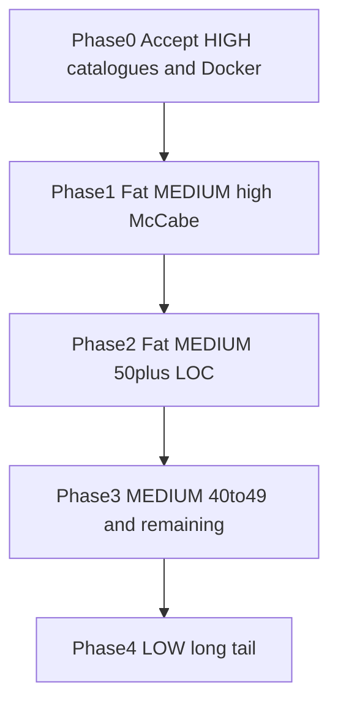

# Unit size remediation phases — LIS

**Source:** [`unit-size-findings-rijkswaterstaat-otg-lis-20260717.csv`](./unit-size-findings-rijkswaterstaat-otg-lis-20260717.csv)  
**Scope:** Unit size only  
**Related:** Living overall plan in [`REMEDIATION-PLAN.md`](./REMEDIATION-PLAN.md); architecture in [`ARCHITECTURE-PHASES.md`](./ARCHITECTURE-PHASES.md)

This document phases unit-size work. Security, reliability, duplication, complexity/interfacing, and architecture live elsewhere.

## Scoreboard (July 17 dedicated export)

| Severity | Count | Notes vs prior full pack |
| --- | ---: | --- |
| HIGH | 4 | Was 5; `mapLoginError` dropped to LOW (17 LOC) |
| MEDIUM | 181 | Was 188; includes 1 Docker row |
| LOW | 486 | Was 478 |
| **Total** | **671** | Unchanged overall RAW |

## Rules

- Behavior-preserving extracts only; public call sites / HTTP / map behavior unchanged.
- Do **not** edit Dockerfiles / Nginx / deployment for score.
- Prefer pure helpers beside the unit; keep the original export path as a short façade when fan-in is high.
- Prioritize **executable** units (McCabe ≥ 8) over McCabe-1 catalogues/config.
- Accept McCabe-1 declarative catalogues unless they start mixing logic.
- Status labels:
  - **Accepted** — declarative catalogue / cohesive key table / intentional shell
  - **Out of scope** — deployment files
  - **Code next** — still large and branchy enough to justify extract
  - **Confirmed cleared** — no longer HIGH/MEDIUM in this export after prior work

---

## Phase 0 — Accept / confirm (no productive split)

**Goal:** Close HIGH without fake catalogue chopping; record confirmations.

| Unit | LOC | McCabe | Status |
| --- | ---: | ---: | --- |
| `nnederlandLayerSpecsPart3.ts` | 83 | 1 | Accepted — declarative layer catalogue |
| `nnederlandLayerSpecsPart2.ts` | 79 | 1 | Accepted — declarative layer catalogue |
| `nnederlandLayerSpecsPart1.ts` | 78 | 1 | Accepted — declarative layer catalogue |
| `voorbereidingTabs.ts` | 63 | 1 | Accepted — declarative tab data |
| `backend/dockerfile` | 59 | — | Out of scope — deployment |
| `mapLoginError.ts` | 17 (LOW) | 4 | Confirmed cleared from HIGH |

**Exit criteria:** HIGH remaining = only Accepted catalogues; Docker excluded from code waves.

---

## Phase 1 — Fat MEDIUM, high complexity (code)

**Goal:** Split units that are both large and branchy (McCabe ≥ 10, TypeScript).

| Unit | CSV LOC | McCabe | File | Action |
| --- | ---: | ---: | --- | --- |
| `useEditPointCoordinateInputs` | 60 | 13 | `.../EditPointCoordinates/useEditPointCoordinateInputs.ts` | Applied — `editPointCoordinateSync` |
| `resolveArcgisTokenConfig` | 58 | 12 | `backend/src/services/arcgisTokenConfig.ts` | Applied — `arcgisTokenConfigResolve` |
| `safeFetchPointAttachments` | 57 | 11 | `.../useHandleStep2/attachments.ts` | Applied — `attachmentFetch` |
| `setupClickListener` | 56 | 11 | `src/hooks/popUpModal/setupClickListener.ts` | Applied — `pointHitSelection` |
| `TimesliderItemDetailPage` | 52 | 16 | `src/Components/TimesliderItemDetailPage/index.tsx` | Applied — `buildTimesliderPageShell` |
| `initPolygonDrawer` | 51 | 10 | `.../SelectedPoint/AddToPlan/index.tsx` | Applied — `polygonDrawer` |
| `handleCopyLink` | 49 | 10 | `.../CreateReport/Steps/Step3/hooks/useCopyLink.ts` | Applied — `copyLinkActions` |
| `useRenderPlanGeometries` | 40 | 15 | `.../VluchtenZoeken/hooks/useRenderPlanGeometries.ts` | Applied — `buildPlanGeometryGraphics` |

Also include other CSV MEDIUM with McCabe ≥ 10 when touching those feature areas.

**Exit criteria:** Listed units are thin orchestration (~≤35 LOC where practical) without behavior change; `npm run check:architecture` green.

---

## Phase 2 — Fat MEDIUM by size (50–60 LOC), moderate complexity

**Goal:** Remaining largest MEDIUM TypeScript units (CSV LOC ≥ 50), even when McCabe is lower.

| Unit / area | CSV LOC | McCabe | Action |
| --- | ---: | ---: | --- |
| `RemovePoint.onSuccess` | 58 | 1 | Applied — `removePointSuccess` |
| `handleStep2` / `useHandleStep2` | 58 | 5 | Applied — `generateReportZip` |
| `buildFlightPlanQuery` | 57 | 9 | Applied — `buildFlightPlanQueryParts` |
| `queryKeys.ts` | 57 | 1 | Accepted — cohesive key catalogue |
| `useTimesliderImagePageData` | 56 | 1 | Accepted — composition-only |
| `usePointsViewController` | 50 | 1 | Accepted — composition-only |
| `Form` (delete-point Step1) | 53 | 2 | Accepted — form field shell |
| `verify-regio-apis` | 56 | 5 | Accepted — backend test script |
| `Main` Aandachtspunten | 55 | 8 | Applied — `attachDeletePointMapClick` |
| `MapViewComp` | 54 | 6 | Applied — `bottomPanelResize` |
| `exportFlightPath` | 54 | 6 | Applied — `exportFlightPathZip` |
| `createSessionMiddleware` | 54 | 5 | Applied — `sessionStoreSetup` |
| `installers.ts` | 55 | 6 | Applied — `installersHandlers` |
| `fetchArcgisAdminTokenOnce` | 52 | 8 | Applied — `arcgisAdminTokenFetch` + shared |
| `createPointFromImport` | 52 | 7 | Applied — `createPointFromImportHelpers` |
| `deleteGeometry` | 51 | 8 | Applied — `deleteGeometryCascade` |
| `getRedisClient` | 50 | 6 | Applied — `connectRedisClient` |
| `fetchTimesliderPlanImages` | 50 | 5 | Applied — `timesliderPlanImagesQuery` |
| `backend/dockerfile` | 59 | — | Out of scope (Phase 0) |

Phase 1 ≥50 leftovers (`useEditPointCoordinateInputs`, `safeFetchPointAttachments`, `setupClickListener`, `TimesliderItemDetailPage`, `initPolygonDrawer`) were already thinned in Phase 1.

**Exit criteria:** CSV ≥50 MEDIUM TypeScript rows are façades/thin units or explicitly Accepted.

---

## Phase 3 — MEDIUM mid-band (40–49 LOC) + remaining McCabe ≥ 8

**Goal:** Work descending LOC within 40–49, and finish leftover McCabe ≥ 8 below 40.

Clusters: Nabewerking edit forms, Voorbereiding map-click hooks, legend specs, backend query builders / auth helpers, Timeslider helpers (`buildTimesliderPageView` McCabe 13 @ 38 LOC).

**Accepted in this band (McCabe 1 declarative):** `overigLayerSpecs`, `pointColumnKeys`, `regionCoordintaes`, symbol catalogues — unless they mix logic.

**Exit criteria:** No open MEDIUM TypeScript with both LOC ≥ 40 and McCabe ≥ 8 left unaddressed or unaccepted.

---

## Phase 4 — LOW long tail (486)

**Goal:** Opportunistic splits when editing a file anyway, or targeted batches of LOW ≥ ~30 LOC with elevated McCabe. Not a blocking gate for dashboard moves.

**Exit criteria:** No dedicated gate; track remaining LOW RAW after next export.

---

## Accepted appendix

Keep these **Accepted** unless review shows bundled responsibilities:

- HIGH McCabe-1 catalogues: `nnederlandLayerSpecsPart{1,2,3}`, `voorbereidingTabs`
- `queryKeys.ts` cohesive React Query key table
- MEDIUM McCabe-1 declarative tables (`pointColumnKeys`, region coordinates, layer/symbol catalogues)
- `useTimesliderImagePageData`, `usePointsViewController` when they remain pure composition
- Delete-point Step1 `Form` when it remains a field-wiring shell
- `verify-regio-apis` backend verification script
- Deployment Dockerfiles (out of scope, not Accepted-for-score)

Reopen an Accepted row only if it starts bundling unrelated concerns or executable branching.

---

## Verification (every code phase)

1. `npm run check:architecture`
2. `npm run test:architecture-helpers` when helpers touched
3. Frontend / backend builds as needed for touched packages
4. Smoke: map edit/click, Timeslider, CreateReport attachments, ArcGIS token path if backend touched
5. No Docker / Nginx / schema / HTTP contract diffs
6. After deploy: compare next unit-size export to `unit-size-findings-rijkswaterstaat-otg-lis-20260717.csv` and move cleared rows to confirmed

## Related

- Overall plan: [`REMEDIATION-PLAN.md`](./REMEDIATION-PLAN.md)
- Architecture phases: [`ARCHITECTURE-PHASES.md`](./ARCHITECTURE-PHASES.md)
- Source CSV: [`unit-size-findings-rijkswaterstaat-otg-lis-20260717.csv`](./unit-size-findings-rijkswaterstaat-otg-lis-20260717.csv)
